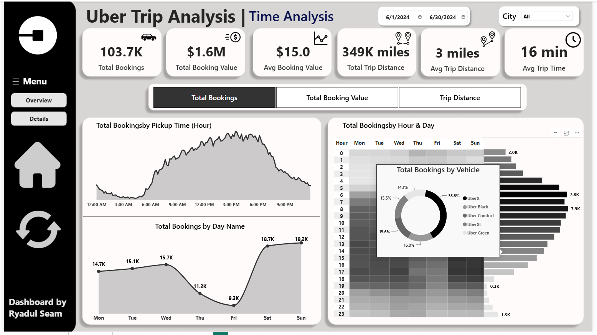
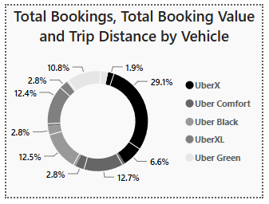

<div align="center">

# 🚕 Uber Trip Analysis | NYC Logistics & Mobility Intelligence

**An end-to-end data analytics project turning 100K+ raw ride-hailing logs into an executive decision-support system.**

`ETL` → `PostgreSQL` → `EDA` → `Machine Learning` → `Power BI` → `Executive Reporting`

[](https://www.python.org/)
[](https://www.postgresql.org/)
[](https://powerbi.microsoft.com/)
[](https://scikit-learn.org/)
[](https://facebook.github.io/prophet/)
[](LICENSE)

[Live Dashboard Preview](#-dashboard-preview) • [Key Insights](#-key-business-insights) • [ML Models](#-machine-learning-models) • [Getting Started](#-getting-started) • [Author](#-author)

</div>

---

## 📌 Overview

This project analyzes **103,728 Uber trips** across New York City boroughs during **June 2024**, covering **$1.6M** in booking value and **349K miles** traveled. It simulates a real-world consulting engagement for a ride-hailing operator that needs visibility into fleet utilization, demand cycles, and revenue drivers to move from **reactive, fixed-shift dispatching** to a **predictive, data-driven supply strategy**.

The project follows a complete analytics lifecycle — from raw CSV ingestion to a polished, interactive Power BI dashboard delivered alongside an executive summary report and stakeholder presentation.

> 📄 Full narrative available in [`reports/executive_summary_report.md`](reports/executive_summary_report.md) and [`notebooks/Conclusion_&_Business_Summary.md`](notebooks/Conclusion_&_Business_Summary.md)

---

## 🧭 Business Problem

Ride-hailing fleets operating without granular visibility into hourly demand curves and vehicle-level margins are forced into reactive dispatching — leading to longer wait times, lower driver earnings, and missed surge revenue. This project builds the analytical foundation (data pipeline, models, and dashboard) needed to answer three core questions:

1. **When** does demand peak, and how should driver supply be staged around it?
2. **Where** are the highest-value pickup/drop-off corridors?
3. **Which** vehicle tiers, payment methods, and customer segments actually drive revenue?

---

## 🏗️ Architecture & Data Pipeline

```
Raw CSVs  →  Python ETL & Cleaning  →  PostgreSQL  →  EDA & Feature Engineering
   →  Machine Learning (scikit-learn, Prophet)  →  Power BI Dashboard  →  Executive Reporting
```

| Stage | Description | Tools |
|---|---|---|
| **1. Extraction** | Ingest 103K+ raw trip records and a location lookup table | `pandas` |
| **2. Structuring** | Clean, type-cast, feature-engineer, and load into a relational database | `pandas`, `PostgreSQL`, `SQLAlchemy` |
| **3. Modeling** | Fare prediction, demand forecasting, customer segmentation, payment classification | `scikit-learn`, `Prophet` |
| **4. Illumination** | Interactive drill-through dashboard with custom DAX and matrix heatmaps | `Power BI`, `DAX` |

---

## 📊 Key Business Insights

| Metric | Value |
|---|---|
| Total Bookings | **103,728** |
| Total Booking Value | **$1.6M** |
| Total Distance Covered | **349K miles** |
| Avg. Booking Value | **$15.0** |
| Avg. Trip Time | **16 min** |

- **Demand is highly time-dependent** — night trips account for **65.3%** of volume, with a sharp commuter/evening surge between **5–7 PM** and weekend revenue peaking on **Sunday ($283K)**.
- **UberX dominates volume** (38,744 bookings) but **premium tiers (Uber Black, Comfort, UberXL)** contribute **$750K+ combined revenue** — a clear upsell opportunity.
- **Geographic concentration**: LaGuardia Airport ($74K), Penn Station ($63K), and JFK Airport ($62K) are the top revenue hubs.
- **Cash and Uber Pay** dominate the payment mix (~99% of transactions); minority methods (Amazon Pay, Google Pay) are too sparse to model reliably.

---

## 🤖 Machine Learning Models

Four exploratory models were built to demonstrate business-oriented ML applications — each evaluated with an **honest, caveated assessment** rather than headline metrics alone.

| Model | Approach | Result | Caveat |
|---|---|---|---|
| **Fare Prediction** | Random Forest Regression | R² = 0.989, RMSE ≈ 0.91 | Unusually high R² suggests fares are near-deterministic from distance/duration in this dataset — treat as proof-of-concept, not a production pricing model |
| **Demand Forecasting** | Prophet (7-day hourly) | Captures daily/weekly seasonality | Needs rigorous hourly resampling and out-of-time validation before production use |
| **Customer Segmentation** | KMeans (k=4) | 4 distinct rider profiles identified | Cluster count chosen without formal elbow/silhouette validation |
| **Payment Classification** | Random Forest Classifier | 91% overall accuracy | Misleading due to severe class imbalance — near-zero precision/recall on minority payment classes |

Scripts: [`scripts/05_ml_fare_prediction.py`](scripts/05_ml_fare_prediction.py) · [`06_ml_demand_forecasting.py`](scripts/06_ml_demand_forecasting.py) · [`07_ml_customer_segmentation.py`](scripts/07_ml_customer_segmentation.py) · [`08_ml_payment_prediction.py`](scripts/08_ml_payment_prediction.py)

---

## 📈 Dashboard Preview

The Power BI dashboard has three pages: **Overview**, **Time Analysis**, and **Details** (row-level drill-through), with synced slicers, date filtering, and custom DAX measures.

<table>
<tr>
<td width="50%">

**Overview Analysis**
Executive KPIs, vehicle-type breakdown, payment mix, and location analysis.


</td>
<td width="50%">

**Time Analysis**
Hourly/daily demand curves and an hour-by-day heatmap matrix.



</td>
</tr>
<tr>
<td width="50%">

**Trip Details (Drill-Through)**
Row-level transaction visibility down to individual trip ID.


</td>
<td width="50%">

**Interactive Tooltip**
Hover-triggered vehicle-type breakdown on the day/hour chart.



</td>
</tr>
</table>

📽️ Full presentation deck: [`reports/project_presentation.pdf`](reports/project_presentation.pdf)

---

## 🗂️ Project Structure

```
uber-trip-analysis-logistics/
│
├── README.md
├── requirements.txt
├── LICENSE
│
├── data/
│   ├── raw_data/                # Original source CSVs
│   └── cleaned_data/            # Cleaned, merged, feature-engineered CSVs
│
├── scripts/                     # Sequential ETL → ML pipeline
│   ├── 01_import_and_load.py
│   ├── 02_etl_cleaning.py
│   ├── 03_eda_visualizations.py
│   ├── 04_save_and_postgres.py
│   ├── 05_ml_fare_prediction.py
│   ├── 06_ml_demand_forecasting.py
│   ├── 07_ml_customer_segmentation.py
│   └── 08_ml_payment_prediction.py
│
├── notebooks/                    # Consolidated analysis notebook + business summary
│   ├── uber-trip-analysis-logistics.ipynb
│   ├── uber-trip-analysis-logistics.html
│   └── Conclusion_&_Business_Summary.md
│
├── sql/
│   └── sql_queries.sql          # Full analytical query set (CTEs, window functions)
│
├── dax/
│   └── measures.dax             # Power BI DAX measures
│
├── reports/
│   ├── executive_summary_report.md
│   └── project_presentation.pdf
│
├── dashboard_images/            # Power BI page exports
└── assets/                       # Dashboard icons & visual elements
```

---

## ⚙️ Getting Started

### Prerequisites
- Python 3.11+
- PostgreSQL instance (local or hosted)
- Power BI Desktop (to open/edit the `.pbix` dashboard)

### Installation

```bash
git clone https://github.com/RyadulSeam/uber-trip-analysis-logistics.git
cd uber-trip-analysis-logistics
pip install -r requirements.txt
```

### Configure the database

Create a `.env` file in the project root with your PostgreSQL credentials:

```
DB_USERNAME=your_username
DB_PASSWORD=your_password
DB_HOST=localhost
DB_PORT=5432
DB_NAME=your_database
```

### Run the pipeline

```bash
cd scripts
python 01_import_and_load.py
python 02_etl_cleaning.py
python 03_eda_visualizations.py
python 04_save_and_postgres.py
python 05_ml_fare_prediction.py
python 06_ml_demand_forecasting.py
python 07_ml_customer_segmentation.py
python 08_ml_payment_prediction.py
```

Then run [`sql/sql_queries.sql`](sql/sql_queries.sql) against the loaded PostgreSQL tables to reproduce the KPIs feeding the dashboard, and open the Power BI file to explore the dashboard interactively.

---

## ⚠️ Limitations

- Dataset spans a single calendar month (June 2024) — seasonal/month-over-month trends cannot be assessed.
- Some location fields contained missing values, imputed as "Unknown."
- All ML models are exploratory/demonstrative and have not been validated on out-of-sample or out-of-time data — a required next step before any production use.

---

## 👤 Author

**Ryadul Seam** — Data Analytics & Power BI Consultant, Founder of **Seam Analytics**

- 🔗 LinkedIn: [linkedin.com/in/ryadulseam-data](https://linkedin.com/in/ryadulseam-data)
- 💻 GitHub: [github.com/RyadulSeam](https://github.com/RyadulSeam)
- 📧 Email: ryadulisla@gmail.com

---

## 📄 License

This project is licensed under the [MIT License](LICENSE).

<div align="center">

⭐ If this project was useful or interesting, consider giving it a star!

</div>