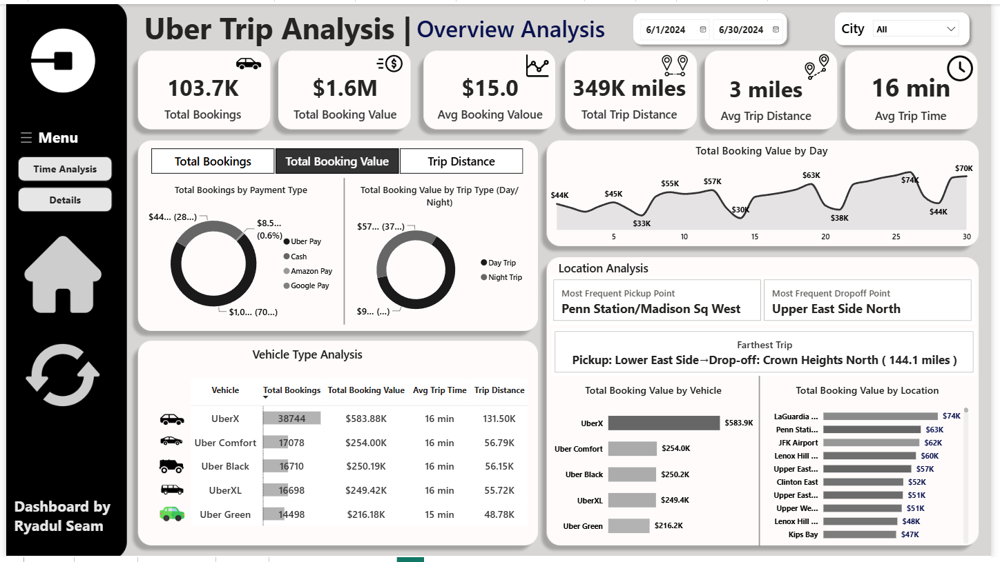
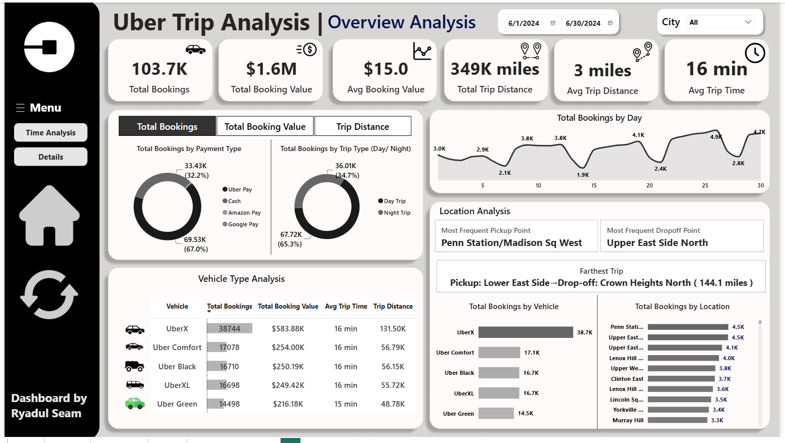
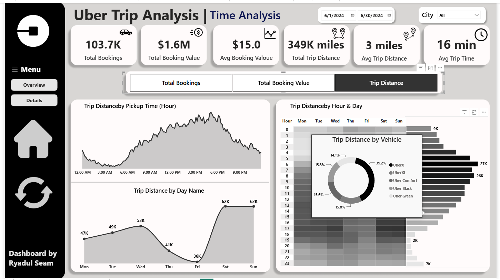
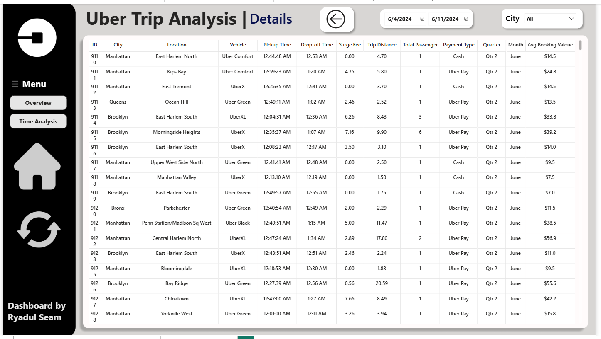

# 🚕 Uber Trip Analysis — NYC Logistics & Mobility Intelligence

**End-to-End Ride-Hailing Analytics & Decision-Support System for a Multi-Borough Uber Operation**



Analyzing **103,728 trips** across New York City boroughs to uncover demand cycles, revenue drivers, and fleet optimization opportunities using **Python, PostgreSQL, Machine Learning, and Power BI**.

---

## 📌 Table of Contents

- [Project Overview](#-project-overview)
- [Business Problem](#-business-problem)
- [Dataset](#-dataset)
- [Tech Stack](#-tech-stack)
- [Project Structure](#-project-structure)
- [Pipeline Workflow](#-pipeline-workflow)
- [Data Cleaning & Feature Engineering](#-data-cleaning--feature-engineering)
- [SQL Analysis Highlights](#-sql-analysis-highlights)
- [Power BI Dashboard](#-power-bi-dashboard)
- [Key Insights](#-key-insights)
- [Machine Learning Models](#-machine-learning-models)
- [Getting Started](#-getting-started)
- [Reports](#-reports)
- [Limitations](#-limitations)
- [Final Recommendations](#-final-recommendations)
- [Author & Contact](#-author--contact)
- [License](#-license)

---

## 📌 Project Overview

This project analyzes **103,728 Uber trips** across New York City boroughs during **June 2024**, covering **$1.6M** in booking value and **349K miles** traveled. It simulates a real-world consulting engagement for a ride-hailing operator that needs visibility into fleet utilization, demand cycles, and revenue drivers in order to move from reactive, fixed-shift dispatching to a predictive, data-driven supply strategy.

The project follows a complete analytics lifecycle — from raw CSV ingestion to a polished, interactive Power BI dashboard — delivered alongside an executive summary report and a stakeholder presentation deck.

**Key result:** Identified a sharp **65.3% night-trip demand share** with a commuter/evening surge between **5–7 PM**, pinpointed **LaGuardia, Penn Station, and JFK** as the top three revenue hubs, and delivered a three-page interactive Power BI dashboard with drill-through to individual trip level.

📄 Full narrative available in `reports/executive_summary_report.md` and `notebooks/Conclusion_&_Business_Summary.md`

---

## 💼 Business Problem

Ride-hailing fleets operating without granular visibility into hourly demand curves and vehicle-level margins are forced into reactive dispatching — leading to longer wait times, lower driver earnings, and missed surge revenue. This project builds the analytical foundation (data pipeline, models, and dashboard) needed to answer three core questions:

1. When does demand peak, and how should driver supply be staged around it?
2. Where are the highest-value pickup/drop-off corridors?
3. Which vehicle tiers, payment methods, and customer segments actually drive revenue?

---

## 🗃️ Dataset

- **Source:** Raw trip-log CSVs + a location lookup table
- **Time Period:** June 2024 (single calendar month)
- **Scope:** 103,728 trips across New York City boroughs
- **Key Columns:** Trip ID, pickup/drop-off timestamps, pickup/drop-off location, vehicle type, distance, fare, payment method, customer ID
- **Processed Versions:** Cleaned, type-cast, and feature-engineered datasets stored in `data/cleaned_data/`

---

## 🛠️ Tech Stack

| Layer | Tools |
|---|---|
| Database | PostgreSQL |
| ETL & Analysis | Python (pandas, SQLAlchemy) |
| Machine Learning | scikit-learn (RandomForestRegressor, RandomForestClassifier, KMeans) |
| Forecasting | Facebook Prophet |
| Visualization (EDA) | matplotlib, seaborn |
| BI Dashboard | Power BI (Power Query, DAX) |
| Data Modeling | Relational schema with custom DAX measures |
| Others | Git, GitHub |

---

## 🗂️ Project Structure

```bash
uber-trip-analysis-logistics/
│
├── README.md
├── requirements.txt
├── LICENSE
│
├── data/
│   ├── raw_data/                # Original source CSVs
│   └── cleaned_data/            # Cleaned, merged, feature-engineered CSVs
│
├── scripts/                     # Sequential ETL → ML pipeline
│   ├── 01_import_and_load.py
│   ├── 02_etl_cleaning.py
│   ├── 03_eda_visualizations.py
│   ├── 04_save_and_postgres.py
│   ├── 05_ml_fare_prediction.py
│   ├── 06_ml_demand_forecasting.py
│   ├── 07_ml_customer_segmentation.py
│   └── 08_ml_payment_prediction.py
│
├── notebooks/                    # Consolidated analysis notebook + business summary
│   ├── uber-trip-analysis-logistics.ipynb
│   ├── uber-trip-analysis-logistics.html
│   └── Conclusion_&_Business_Summary.md
│
├── sql/
│   └── sql_queries.sql          # Full analytical query set (CTEs, window functions)
│
├── dax/
│   └── measures.dax             # Power BI DAX measures
│
├── reports/
│   ├── executive_summary_report.md
│   └── project_presentation.pdf
│
├── dashboard_images/             # Power BI page exports
└── assets/                       # Dashboard icons & visual elements
```

---

## 🔄 Pipeline Workflow

```
Raw CSVs (103,728 trips)
        │
        ▼
  01_import_and_load.py    → ingests raw trip records and location lookup table
        │
        ▼
  02_etl_cleaning.py       → cleans, type-casts, and feature-engineers the dataset
        │
        ▼
  03_eda_visualizations.py → exploratory visuals: hourly, daily, and borough-level trends
        │
        ▼
  04_save_and_postgres.py  → loads cleaned data into PostgreSQL
        │
        ├──▶ 05_ml_fare_prediction.py        (Random Forest Regression)
        ├──▶ 06_ml_demand_forecasting.py     (Prophet, 7-day hourly)
        ├──▶ 07_ml_customer_segmentation.py  (KMeans, k=4)
        └──▶ 08_ml_payment_prediction.py     (Random Forest Classification)
        │
        ▼
  PostgreSQL                → sql_queries.sql (demand curves, revenue hubs, vehicle-tier mix)
        │
        ▼
  Power BI                  → measures.dax + dashboard visuals → Executive Summary & Presentation
```

---

## 🧹 Data Cleaning & Feature Engineering

- Converted raw pickup/drop-off timestamps into proper datetime format
- Type-cast and cleaned vehicle type, payment method, and location fields
- Engineered time-based features (hour, day-of-week, night/day flag) for demand analysis
- Imputed missing location values as "Unknown" rather than dropping records
- Built a relational schema and loaded cleaned data into PostgreSQL for downstream querying

---

## 📊 SQL Analysis Highlights

The `sql/sql_queries.sql` file contains modular, CTE-driven queries covering:

- Hourly and day-of-week demand curves used to build the heatmap matrix
- Revenue ranking by pickup/drop-off location (airport and station hubs)
- Vehicle-tier revenue contribution vs. trip volume
- Payment method distribution and reliability checks
- Window-function-based trip and revenue trend analysis

---

## 📈 Power BI Dashboard

An interactive, three-page dashboard with synced slicers, date filtering, and custom DAX measures:

- **Overview** — Executive KPIs, vehicle-type breakdown, payment mix, and location analysis
- **Time Analysis** — Hourly/daily demand curves and an hour-by-day heatmap matrix, with hover-triggered vehicle-type tooltips
- **Details (Drill-Through)** — Row-level transaction visibility down to individual trip ID

| Overview | Time Analysis | Trip Details |
|---|---|---|
|  |  |  |

📽️ Full presentation deck: `reports/project_presentation.pdf`

---

## 🔍 Key Insights

- **Demand timing:** Night trips account for **65.3%** of total volume, with a sharp commuter/evening surge between **5–7 PM**; weekend revenue peaks on **Sunday ($283K)**.
- **Overall performance:** Total Bookings = **103,728**, Total Booking Value = **$1.6M**, Total Distance = **349K miles**, Avg. Booking Value = **$15.0**, Avg. Trip Time = **16 min**.
- **Vehicle-tier mix:** UberX dominates volume (**38,744 bookings**), but premium tiers (Uber Black, Comfort, UberXL) contribute **$750K+** combined revenue — a clear upsell opportunity for tier-mix optimization.
- **Geographic concentration:** **LaGuardia Airport ($74K)**, **Penn Station ($63K)**, and **JFK Airport ($62K)** are the top three revenue hubs — priority zones for driver staging.
- **Payment mix:** Cash and Uber Pay dominate transactions (**~99%**); minority methods (Amazon Pay, Google Pay) are too sparse to model reliably.

Full strategic recommendations are available in `reports/executive_summary_report.md`.

---

## 🤖 Machine Learning Models

Four exploratory models were built to demonstrate business-oriented ML applications — each evaluated with an honest, caveated assessment rather than headline metrics alone.

| Model | Approach | Result | Caveat |
|---|---|---|---|
| Fare Prediction | Random Forest Regression | R² = 0.989, RMSE ≈ 0.91 | Unusually high R² suggests fares are near-deterministic from distance/duration in this dataset — treat as proof-of-concept, not a production pricing model |
| Demand Forecasting | Prophet (7-day hourly) | Captures daily/weekly seasonality | Needs rigorous hourly resampling and out-of-time validation before production use |
| Customer Segmentation | KMeans (k=4) | 4 distinct rider profiles identified | Cluster count chosen without formal elbow/silhouette validation |
| Payment Classification | Random Forest Classifier | 91% overall accuracy | Misleading due to severe class imbalance — near-zero precision/recall on minority payment classes |

Scripts: `scripts/05_ml_fare_prediction.py` · `06_ml_demand_forecasting.py` · `07_ml_customer_segmentation.py` · `08_ml_payment_prediction.py`

---

## ⚙️ Getting Started

### Prerequisites

**Required:**
- Python 3.11+ 
- PostgreSQL (local or hosted) 
- Power BI Desktop (to open/edit the `.pbix` dashboard) 

**Recommended Tools:**
- VS Code (with Python extension)
- Jupyter Notebook (for exploratory analysis)
- Git & GitHub

### Install Dependencies

```bash
git clone https://github.com/RyadulSeam/uber-trip-analysis-logistics.git
cd uber-trip-analysis-logistics
pip install -r requirements.txt
```

### Configure the Database

Create a `.env` file in the project root with your PostgreSQL credentials:

```
DB_USERNAME=your_username
DB_PASSWORD=your_password
DB_HOST=localhost
DB_PORT=5432
DB_NAME=your_database
```

### Run the Pipeline

```bash
cd scripts
python 01_import_and_load.py
python 02_etl_cleaning.py
python 03_eda_visualizations.py
python 04_save_and_postgres.py
python 05_ml_fare_prediction.py
python 06_ml_demand_forecasting.py
python 07_ml_customer_segmentation.py
python 08_ml_payment_prediction.py
```

> **Note:** Then run `sql/sql_queries.sql` against the loaded PostgreSQL tables to reproduce the KPIs feeding the dashboard, and open the Power BI file to explore the dashboard interactively.

### View the Dashboard

Open the Power BI `.pbix` file ( not included in this repo for size reasons, DM me on [linkedin.com/in/ryadulseam-data](https://www.linkedin.com/in/ryadulseam-data) for the live .pbix file ) and connect it to your local PostgreSQL instance, or explore the static exports in `dashboard_images/`.

---

## 📁 Reports

- 📄 **[Executive Summary](reports/executive_summary_report.md)** — strategic overview and business recommendations
- 📊 **[Project Presentation](reports/project_presentation.pdf)** — stakeholder-facing slide deck
- 🗒️ **[Conclusion & Business Summary](notebooks/Conclusion_&_Business_Summary.md)** — full analytical narrative

---

## ⚠️ Limitations

- Dataset spans a single calendar month (June 2024) — seasonal/month-over-month trends cannot be assessed.
- Some location fields contained missing values, imputed as "Unknown."
- All ML models are exploratory/demonstrative and have not been validated on out-of-sample or out-of-time data — a required next step before any production use.

---

## ✅ Final Recommendations

- Stage driver supply ahead of the 5–7 PM commuter surge and the Sunday revenue peak
- Prioritize driver positioning around LaGuardia, Penn Station, and JFK — the top three revenue hubs
- Promote premium vehicle tiers (Black, Comfort, XL) to riders in high-value corridors to capture the upsell opportunity
- Validate the fare prediction and demand forecasting models on out-of-time data before any production deployment
- Expand the dataset beyond a single month to enable seasonal and month-over-month analysis
- Address class imbalance before relying on the payment classification model operationally

---

## 👤 Author & Contact

**Ryadul Seam**

**Data Analytics & Power BI Consultant | Founder @ SEAM ANALYTICS**

**I help Retail, Logistics, and Mobility teams turn raw operational data into clear, actionable business insights.**

- 📧 Email: [ryadulisla@gmail.com](mailto:ryadulisla@gmail.com)
- 🔗 LinkedIn: [linkedin.com/in/ryadulseam-data](https://www.linkedin.com/in/ryadulseam-data)
- 💻 GitHub: [github.com/RyadulSeam](https://github.com/RyadulSeam)

Feel free to connect or reach out to collaborate on your next analytics project.

---

## 📄 License 

This project is licensed under the **MIT License** — see the [LICENSE](LICENSE) file for details.

---

<p align="center">Built with ❤️ for data-driven mobility & logistics decisions<br>⭐ Star this repo if you found it useful!</p>
